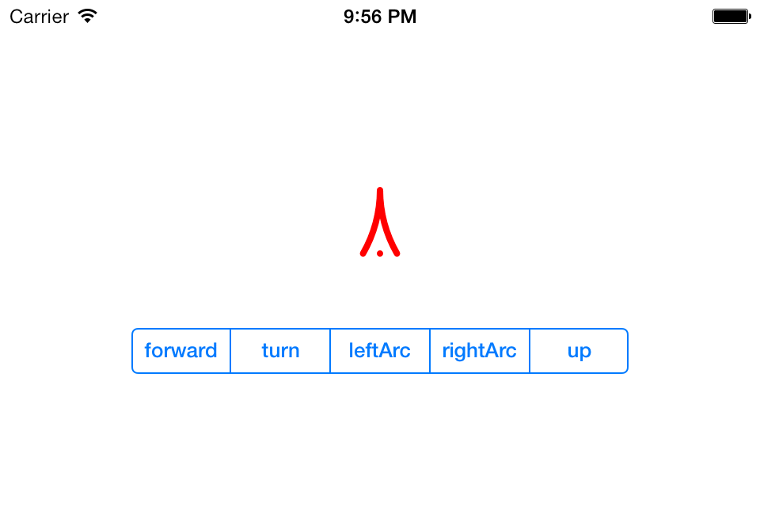

TurtleBezierPath
===================

`TurtleBezierPath` is a `UIBezierPath` subclass for Turtle Graphics: a simple, intuitive drawing system developed my Seymour Papert for the Logo programming language.

The Turtle is a drawing cursor that follows the commands: `home`, `forward`, `leftArc`, `rightArc`, `up` and `down`. As the Turtle moves, it draws a path in its wake. Many shapes are much easier to draw this way.

The demo app
------------------

The app requires iOS 7 and allows you to explore Turtle Graphics drawing with simple controls. It's fun too!

Installation
------------------
Simply add `TurtleBezierPath.h` and `TurtleBezierPath.m` to your project.

`TurtleBezierPath.h` will work with both ARC and MRC projects.

@interface
-----
`@property( nonatomic, assign ) CGFloat bearing;`

The compass bearing of the Turtle in *degrees*

* 0 - North
* 90 - East
* 180 - South
* 270 - West

`@property( nonatomic, assign ) BOOL penUp;`

The position of the drawing pen. When it is up the Turtle will move but not draw.

`-(CGRect)boundsWithStroke;`

The bounds rect of the path including the stroke width.

`-(void)home;`

Move the Turtle to `CGPointZero` and set the bearing to 0.

`-(void)forward:(CGFloat)distance;`

Move the Turtle forward distance points.

`-(void)turn:(CGFloat)angle;`

Add angle degress to the Turtle's bearing.

`-(void)leftArc:(CGFloat)radius turn:(CGFloat)angle;`

Move the Turtle in an anti-clockwise arc.

`-(void)rightArc:(CGFloat)radius turn:(CGFloat)angle;`

Move the Turtle in a clockwise arc.

`-(void)down;`

Set the pen down.

`-(void)up;`

Set the pen up.

`-(void)centreInBounds:(CGRect)bounds;`

Transform the path so that the home position is in the centre of the bounds.

@end
-----
